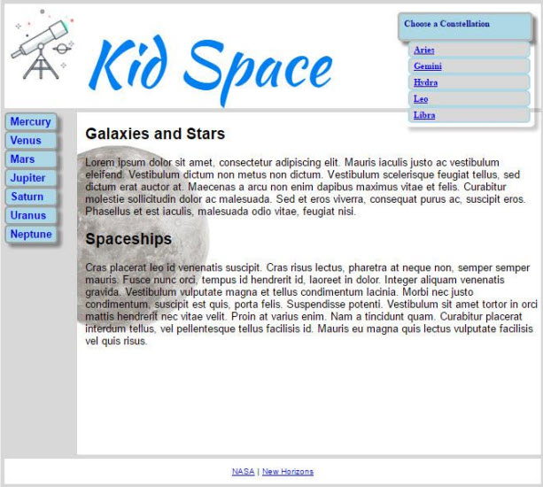

# Exercise 2: More Kid Space

Add a logo to the header to the landing page in the last exercise. Use the web to find an image for this
exercise, or use an image editor to make your own.

Add a background image to the main area of the page. Again, use the web to find one for this exercise,
or use an image editor to make your own.

Add a drop down menu in the header to pick the name of a constellation. The links are just placeholders.
Be creative! Make the design your own. My simplistic solution is shown below.

## Example Solution

