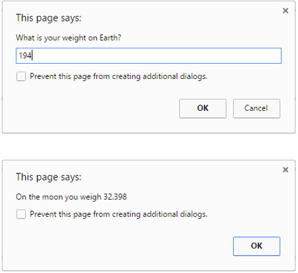

# Exercise 3: Weight on the Moon

Create a JavaScript function that calculates weights on the moon. The function should take a single
parameter: the weight on Earth. The function should return the weight converted to the moon’s gravity
(multiply Earth weight by 0.167).

As the Kid Space page is loading, prompt the user for his or her weight on Earth. Then call your
JavaScript function to make the conversion.

Show the converted value to the user with an alert.

Optional: Use HTML elements for input and output. Let the user pick a destination planet from a list.
Convert the weight to the destination planet.

# Example Solution

