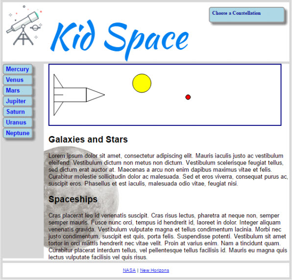

# Exercise 4: Canvas Art

Add a `<canvas>` element to the top of the Kid Space page. Use JavaScript to draw a space scene on the
canvas! You might draw a rocket or UFO – let your imagination reach for the stars!

You can use a sheet of graph paper to plan your drawing. You can laugh at my drawing below.

The `<canvas>` 2D context has a rich API. Search the web for examples and ideas.

One thing I discovered is to "begin", "close", and "stroke" the path between individual shapes.

# Example Solution

