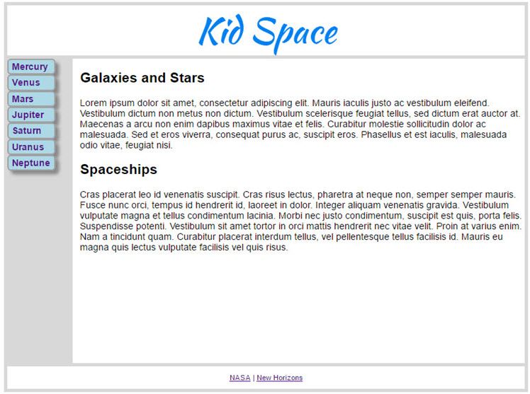

# Exercise 1: Kid Space

You are building the landing page for a cool new, kid-friendly web site called "Kid Space".

Your page should have a header [1] and footer [2] and two sections [3] of educational material. You can use fake text in place of the actual material.

Your page should have a navigation section on the left with several links [4] (maybe one for each planet). Your footer should have a link [5] to the NASA web site and anything else you want to add. None of these links needs be functional – they are just placeholders.

Your header should have "Kid Space" centered in a creative font of your choice [6].

Use an external CSS stylesheet to style the page [7]. You should validate your final HTML with the online validator.

Be creative! Add elements you think the web site needs. My minimal solution is shown below.

# References to course material

[1] and [2] and [3]: See Section 1, "HTML5 Structure Elements". Figure 1-7 is particularly useful.

[4] and [5]: See Section 1, "Lab 1-1". The example code is very close to what we want to do here. It shows the NAV and links.

[6]: See Section 2, "Lab 2-1". The example shows centering in a FOOTER.

[7]: See Section 2, "Applying CSS Styles". The example shows a link to an external style sheet.

