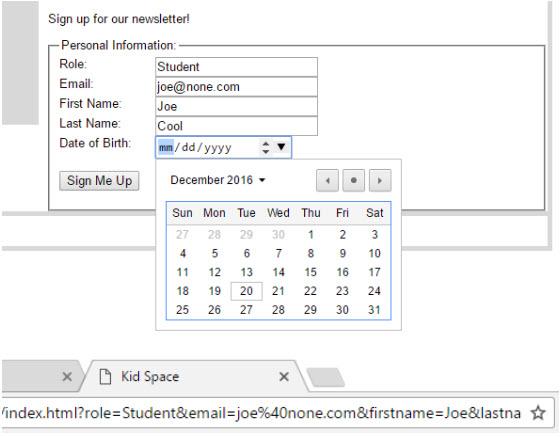

# Exercise 3: Sign me up!

Add a `<form>` element to the bottom of the Kid Space page. The form allows users to sign up for our free
newsletter!

Gather the following information plus anything else you want to know:
  - Role (Student or Teacher)
  - Email (REQUIRED)
  - First Name (REQUIRED)
  - Last Name
  - Date of Birth
  
Use the form action URL "#", which targets the current page. You will be able to see your form
parameters in the browser's URL line (see example below).

I used a CSS style of "width:8em; float:left" for the label `<spans>` in my form (see below). Use your
creativity in styling your own form.

# Example Solution

